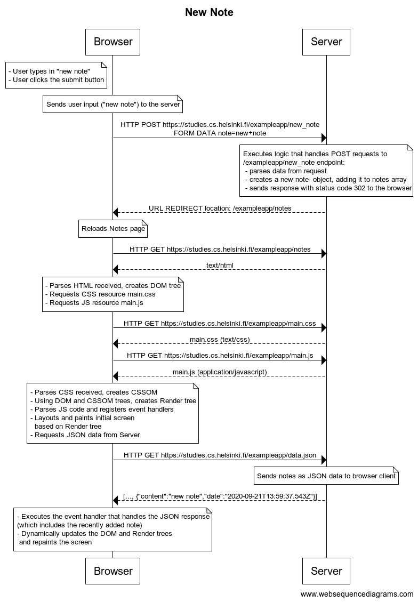
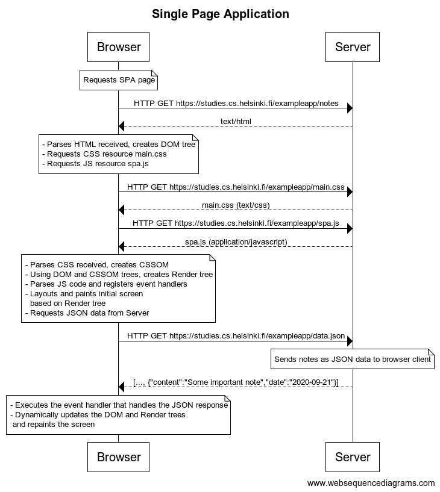
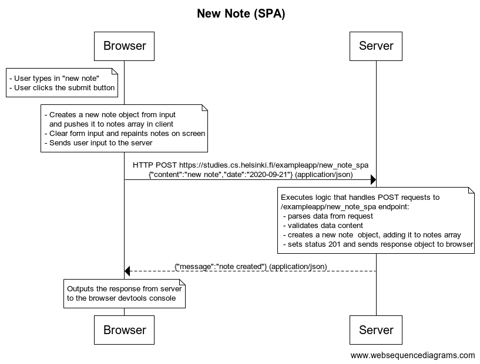

# Exercise Solutions 0.4.-0.6.

- Diagrams were created using [WebSequenceDiagrams](https://www.websequencediagrams.com/)

- Note that the diagrams may slightly differ from the way the browsers actually executes all the steps up to the first and subsequent paintings of the screen.

- Helpful resorces: [How CSS Works?](https://developer.mozilla.org/en-US/docs/Learn/CSS/First_steps/How_CSS_works), [What is JavaScript?](https://developer.mozilla.org/en-US/docs/Learn/JavaScript/First_steps/What_is_JavaScript) and [Critical Rendering Path](https://developers.google.com/web/fundamentals/performance/critical-rendering-path) series.

## 0.4: New Note

[Diagram source code](./new-note)

## 0.5: Single Page Application (SPA)

[Diagram source code](./spa)

## 0.6: New Note (SPA)

[Diagram source code](./new-note-spa)
